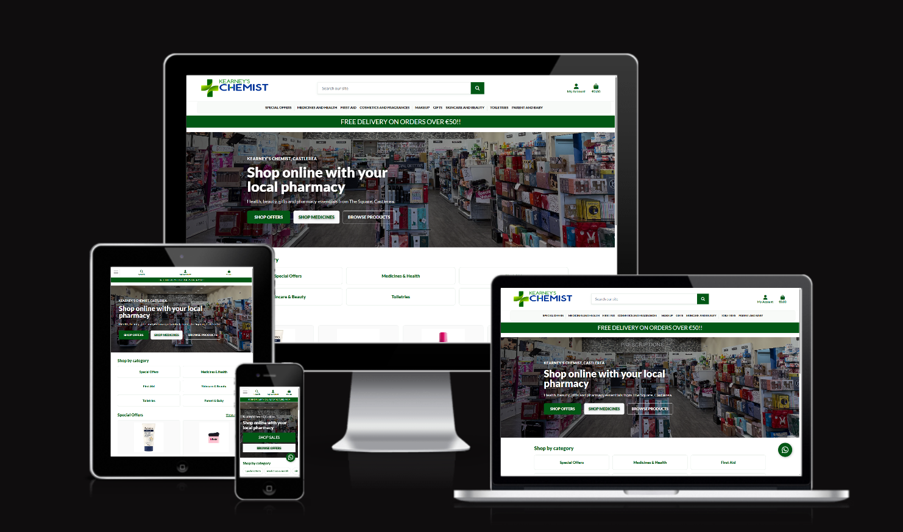
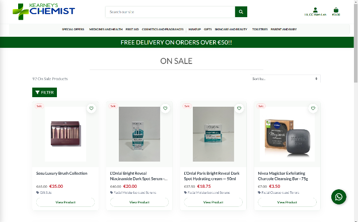
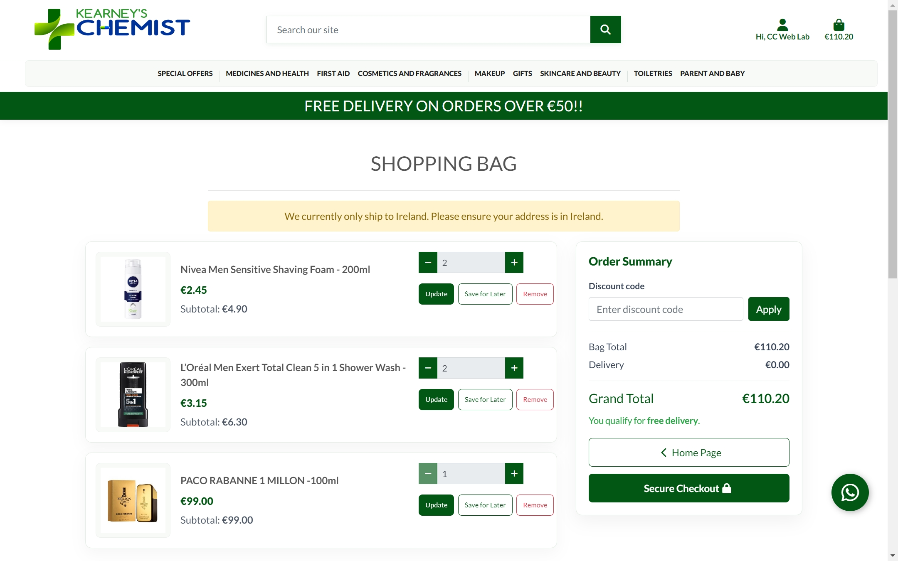
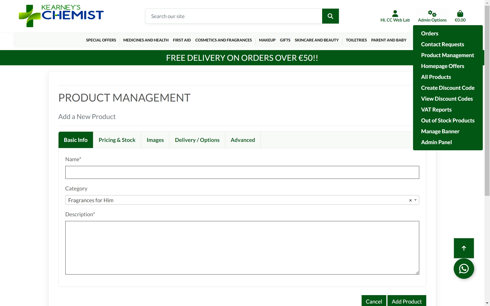

# Kearney's Chemist

### Custom e-commerce for an independent Irish pharmacy.

Kearney's Chemist is a custom e-commerce platform developed for an independent pharmacy in Ireland. The platform provides a complete online shopping experience while supporting the pharmacy's day-to-day product, order, payment and fulfilment workflows.

🌐 **Live website:** https://www.kearneyschemist.com

> **Note:** This is the public showcase repository for Kearney's Chemist. The production source code is maintained privately and can be made available for review on request.

## ✨ Key Features

- **Online Storefront** — browse and purchase pharmacy, health, beauty and personal care products online.
- **Product Management** — manage products, categories, pricing, stock and product variants.
- **Basket & Checkout** — complete customer ordering flow with secure online payment.
- **Click & Collect** — customers can place orders online for collection from the pharmacy.
- **Delivery Management** — Ireland-focused delivery with configurable shipping rules and free-delivery thresholds.
- **VAT Handling** — support for products across multiple VAT rates and accurate order-level tax calculations.
- **Order Management** — administrative tools for managing orders, fulfilment and customer communication.
- **Refund Management** — refund tracking with associated VAT adjustments.
- **Transactional Email** — automated customer communications throughout the ordering and collection process.
- **Google Merchant Integration** — automated product feed supporting product discovery through Google.
- **SEO & Structured Data** — search-friendly product pages, metadata, canonical URLs and structured data.

## 🛍️ Online Storefront

The responsive storefront allows customers to browse products, discover special offers and purchase products online. Product cards surface pricing, discounts and key product information while providing a clear route into the purchasing flow.

## 🛒 Shopping & Checkout

The custom shopping flow handles basket management, product quantities, order totals, delivery rules and secure checkout.

Customers can choose between delivery and Click & Collect, with fulfilment rules integrated directly into the ordering experience.

## 🛠️ Technology

Kearney's Chemist is built with:

**Python · Django · MySQL · JavaScript · HTML · CSS · Stripe · Nginx · Gunicorn · Linux**

The application is deployed on a Linux VPS using Nginx and Gunicorn, with separate staging and production environments.

## ⚙️ Engineering Highlights

- Developed a custom Django e-commerce platform around the requirements of a real retail business.
- Implemented secure payment and checkout workflows using Stripe.
- Built product, category, stock, variant and order-management functionality.
- Implemented multiple VAT rates across the product catalogue and transaction lifecycle.
- Developed Click & Collect and delivery workflows tailored to the pharmacy.
- Added refund tracking and VAT credit handling for financial record keeping.
- Built an automated Google Merchant product feed that reflects the live catalogue.
- Implemented SEO improvements including structured data, canonical URLs, sitemaps and social metadata.
- Maintained separate staging and production environments for safer deployment and testing.

## 📦 Product Management

Custom administrative tools support day-to-day catalogue management, including product information, pricing, stock, images, delivery settings and other product data.

The administration functionality was developed around the requirements of the pharmacy, allowing the online catalogue to be managed without working directly with the underlying application or database.

## 👨‍💻 My Role

I designed, developed and maintain the custom web platform for Kearney's Chemist, covering both the customer-facing e-commerce experience and the supporting administrative functionality.

My work includes feature development, testing, deployment, ongoing maintenance and improvements based on the requirements of the business.

## 📱 Responsive Design

The storefront is designed to work across desktop, tablet and mobile devices, providing customers with a consistent shopping and checkout experience.

## 🚀 Project Status

Kearney's Chemist is a live production e-commerce platform and continues to receive maintenance, feature improvements and operational updates.

## 👤 Developer

**Clive Connell**  
Software Development student at Atlantic Technological University.

For questions about the project or requests to review the source code, please contact me through my GitHub profile.
